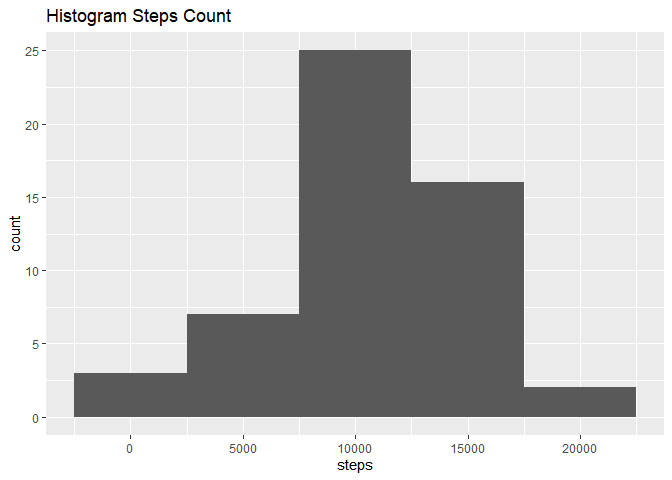
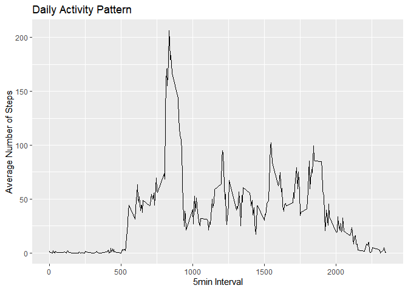
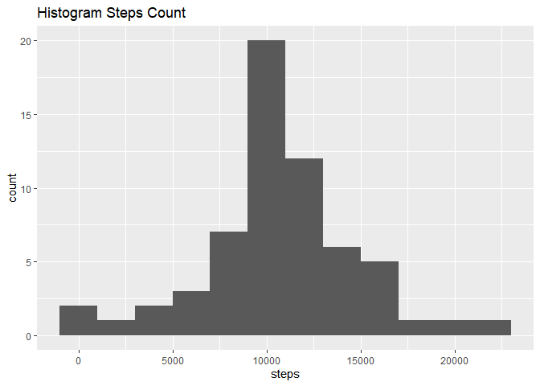
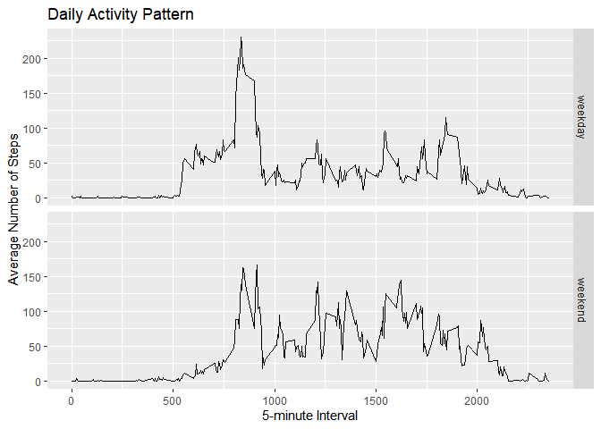

## R Markdown

Assignmentless 
This assignment will be described in multiple parts. You will need to write a report that answers the questions detailed below. Ultimately, you will need to complete the entire assignment in a single R markdown document that can be processed by knitr and be transformed into an HTML file.

Throughout your report make sure you always include the code that you used to generate the output you present. When writing code chunks in the R markdown document, always use \color{red}{\verb|echo = TRUE|}echo=TRUE so that someone else will be able to read the code. This assignment will be evaluated via peer assessment so it is essential that your peer evaluators be able to review the code for your analysis.

For the plotting aspects of this assignment, feel free to use any plotting system in R (i.e., base, lattice, ggplot2)

Fork/clone the GitHub repository created for this assignment. You will submit this assignment by pushing your completed files into your forked repository on GitHub. The assignment submission will consist of the URL to your GitHub repository and the SHA-1 commit ID for your repository state.

NOTE: The GitHub repository also contains the dataset for the assignment so you do not have to download the data separately.

Loading and preprocessing the data
Show any code that is needed to

Load the data (i.e. read.csv())

```r
df <- read.csv(file="activity.csv", header=TRUE)
str(df)
```

```
## 'data.frame':	17568 obs. of  3 variables:
##  $ steps   : int  NA NA NA NA NA NA NA NA NA NA ...
##  $ date    : Factor w/ 61 levels "2012-10-01","2012-10-02",..: 1 1 1 1 1 1 1 1 1 1 ...
##  $ interval: int  0 5 10 15 20 25 30 35 40 45 ...
```
Process/transform the data (if necessary) into a format suitable for your analysis
Load the data 

```r
library(tidyverse)
```

```
## Warning: package 'tidyverse' was built under R version 3.6.2
```

```
## -- Attaching packages --------------------------------------------------------------------------- tidyverse 1.3.0 --
```

```
## v ggplot2 3.2.1     v purrr   0.3.3
## v tibble  2.1.3     v dplyr   0.8.3
## v tidyr   1.0.0     v stringr 1.4.0
## v readr   1.3.1     v forcats 0.4.0
```

```
## -- Conflicts ------------------------------------------------------------------------------ tidyverse_conflicts() --
## x dplyr::filter() masks stats::filter()
## x dplyr::lag()    masks stats::lag()
```

```r
df$date <- as.Date(df$date)
str(df)
```

```
## 'data.frame':	17568 obs. of  3 variables:
##  $ steps   : int  NA NA NA NA NA NA NA NA NA NA ...
##  $ date    : Date, format: "2012-10-01" "2012-10-01" ...
##  $ interval: int  0 5 10 15 20 25 30 35 40 45 ...
```

What is mean total number of steps taken per day?
For this part of the assignment, you can ignore the missing values in the dataset.
1. Calculate the total number of steps taken per day

```r
totalsteps <- aggregate(steps ~ date, df, FUN=sum)
```

2.If you do not understand the difference between a histogram and a barplot, research the difference between them. Make a histogram of the total number of steps taken each day

```r
ggplot(totalsteps, aes(x = steps)) + geom_histogram(binwidth = 5000 ) + ggtitle("Histogram Steps Count")
```

<!-- -->
3.Calculate and report the mean and median of total steps taken per day

```r
summary(totalsteps$steps)
```

```
##    Min. 1st Qu.  Median    Mean 3rd Qu.    Max. 
##      41    8841   10765   10766   13294   21194
```

```r
meanst <- mean(totalsteps$steps, na.rm = TRUE)
meanst
```

```
## [1] 10766.19
```

```r
median <- median(totalsteps$steps, na.rm = TRUE)
median
```

```
## [1] 10765
```

What is the average daily activity pattern?
1.  a time series plot (i.e. \color{red}{\verb|type = "l"|}type="l") of the 5-minute interval (x-axis) and the average number of steps taken, averaged across all days (y-axis)

```r
meanstepsint <- aggregate(steps ~ interval, df, mean)
ggplot(data = meanstepsint, aes(x = interval, y = steps)) + geom_line() +
  ggtitle("Daily Activity Pattern") +
  xlab("5min Interval") +
  ylab("Average Number of Steps") 
```

<!-- -->


2. Which 5-minute interval, on average across all the days in the dataset, contains the maximum number of steps?

```r
maxsteps5min <- meanstepsint[which.max(meanstepsint$steps),]
maxsteps5min
```

```
##     interval    steps
## 104      835 206.1698
```

Imputing missing values
Note that there are a number of days/intervals where there are missing values (coded as \color{red}{\verb|NA|}NA). The presence of missing days may introduce bias into some calculations or summaries of the data.

1. Calculate and report the total number of missing values in the dataset (i.e. the total number of rows with \color{red}{\verb|NA|}NAs)

```r
NAcount <- missingVals <- is.na(df$steps)
sum(NAcount)
```

```
## [1] 2304
```
2.Devise a strategy for filling in all of the missing values in the dataset. The strategy does not need to be sophisticated. For example, you could use the mean/median for that day, or the mean for that 5-minute interval, etc.

I will use the mean

3. Create a new dataset that is equal to the original dataset but with the missing data filled in.
Replace NA's with the mean.

```r
mod.df <- transform(df, steps = ifelse(is.na(df$steps),
                                       meanstepsint$steps[match(df$interval, 
                                       meanstepsint$interval)],
                                             df$steps))
```
4.Make a histogram of the total number of steps taken each day and Calculate and report the mean and median total number of steps taken per day. Do these values differ from the estimates from the first part of the assignment? What is the impact of imputing missing data on the estimates of the total daily number of steps?

```r
mod.meansteps <- aggregate(steps ~ date, mod.df, FUN=sum) 
ggplot(mod.meansteps, aes(x = steps)) + geom_histogram(binwidth = 2000 ) + ggtitle("Histogram Steps Count")
```

<!-- -->

```r
summary(mod.meansteps$steps)
```

```
##    Min. 1st Qu.  Median    Mean 3rd Qu.    Max. 
##      41    9819   10766   10766   12811   21194
```

```r
mod.mean <- mean(mod.meansteps$steps, na.rm = TRUE)
mod.mean
```

```
## [1] 10766.19
```

```r
mod.median <- median(mod.meansteps$steps, na.rm = TRUE)
mod.median
```

```
## [1] 10766.19
```
The mean does not change, but now the median is equal to the mean.

Are there differences in activity patterns between weekdays and weekends?
For this part the \color{red}{\verb|weekdays()|}weekdays() function may be of some help here. Use the dataset with the filled-in missing values for this part.

1. Create a new factor variable in the dataset with two levels – “weekday” and “weekend” indicating whether a given date is a weekday or weekend day.

```r
#Kind of a messy solution, but it worked
mod.df$daytype <- weekdays(mod.df$date)
mod.df.wends <- subset(mod.df, mod.df$daytype == "Sunday" | daytype == "Saturday")
mod.df.wends$daytype2 <- "weekend"
mod.df2 <- merge(mod.df, mod.df.wends, intersect(names(mod.df), names(mod.df.wends)), all.x = TRUE)
mod.df2 <- transform(mod.df2, daytype2 = ifelse(is.na(mod.df2$daytype2), "weekday", "weekend"))
```


2.Make a panel plot containing a time series plot (i.e. \color{red}{\verb|type = "l"|}type="l") of the 5-minute interval (x-axis) and the average number of steps taken, averaged across all weekday days or weekend days (y-axis). See the README file in the GitHub repository to see an example of what this plot should look like using simulated data.

```r
meanstepsbyday2 <- aggregate(steps ~ interval + daytype2, mod.df2, mean)
ggplot(data = meanstepsbyday2, aes(x = interval, y = steps)) + 
  geom_line() +
  facet_grid(daytype2 ~ .) +
  ggtitle("Daily Activity Pattern") +
  xlab("5-minute Interval") +
  ylab("Average Number of Steps")
```

<!-- -->
